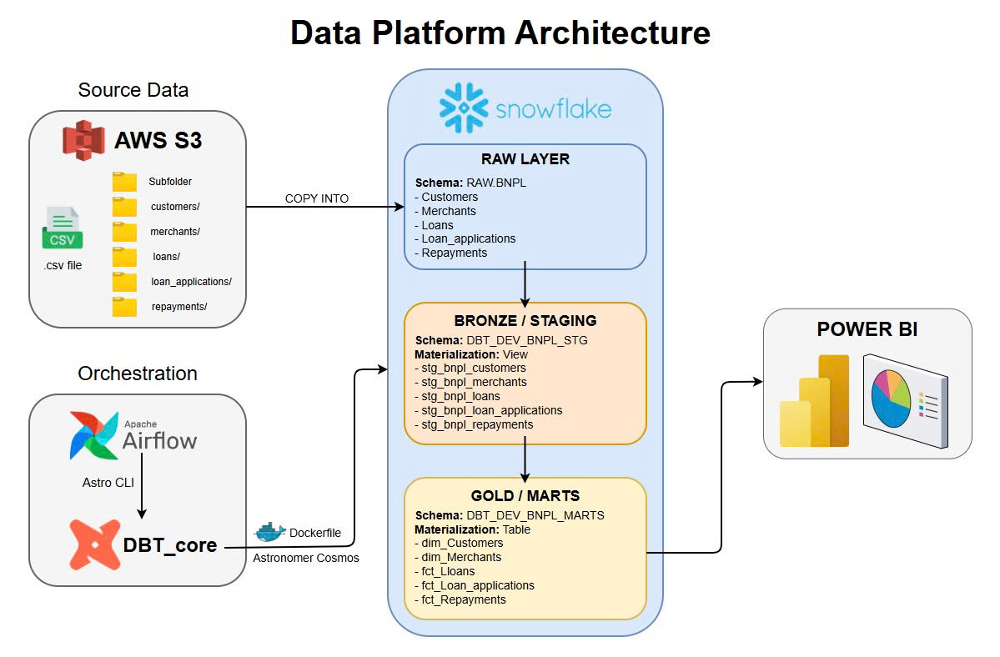

# Data Pipeline: dbt, Snowflake & Airflow (via Cosmos)

This repository contains a modern Data Engineering pipeline designed to build a comprehensive **Buy-Now-Pay-Later** view for a financial institution. It leverages **dbt (Data Build Tool)** for data transformation, **Snowflake** as the cloud data warehouse, and **Apache Airflow** (using **Astronomer Cosmos**) for seamless orchestration.

## 🚀 Tech Stack & Architecture

* **Orchestration:** [Apache Airflow](https://airflow.apache.org/) (managed via [Astro CLI](https://docs.astronomer.io/astro/cli/overview))
* **Transformation:** [dbt-core](https://www.getdbt.com/) & `dbt-snowflake`
* **Data Warehouse:** [Snowflake](https://www.snowflake.com/)
* **Integration:** [Astronomer Cosmos](https://astronomer.github.io/astronomer-cosmos/) (Dynamically converts dbt projects into Airflow DAGs)

## 📁 Project Structure

The project follows dbt best practices, organizing data transformations into distinct layers:

```text
BNPL/
├── Dockerfile                  # Astro Runtime image & dbt virtual env setup
├── requirements.txt            # Airflow providers (Cosmos, Snowflake)
├── dags/
│   ├── cosmos_snowflake_dbt.py # Airflow DAG using Cosmos DbtDag
│   └── dbt/dbt_BNPL/
│       ├── dbt_project.yml     # dbt project configuration
│       ├── seeds/              # Reference data (CSV mappings, risk ratings, etc.)
│       └── models/
│           ├── staging/        # Base layer: Raw data cleansing & standardization
│           └── marts/          # Presentation layer: Business-ready tables (Executive, Marketing)
```

## 📊 Data Modeling Architecture (dbt Models)

The project follows a layered dbt architecture to ensure maintainability, scalability, and clear separation of concerns.

### Staging Layer (`models/staging`)

The foundational layer. Models here typically maintain a 1:1 relationship with raw source tables. The primary goal is data cleansing and standardization: renaming columns for consistency, casting data types, handling `NULL` values, and removing exact duplicates.
Standardizes raw source tables into clean, consistently formatted views:

* Customers
* Merchants
* Loans

This layer serves as the foundation for downstream transformations.

---

### Marts Layer (`models/marts`)

The presentation layer. These are highly denormalized, wide tables optimized for Business Intelligence (BI) tools (like Power BI or Tableau) and end-user consumption. They are organized by business unit to ensure data is strictly tailored to stakeholder needs:
* **Risk Operations (`/risk_operations`):** * `risk_management_dashboard`: Monitoring defaults, delinquent loans, and high-risk customer profiles.

These models are consumed directly by:

* BI dashboards
* Reporting tools
* Data analysts
* Business stakeholders

---

## ⚙️ Prerequisites

Before you begin, ensure the following dependencies are installed:

* Docker Desktop (Running)
* Astro CLI
* Snowflake Account

---

## 🛠️ Local Setup & Execution

### 1. Configure the Environment

Create a `.env` file in the project root directory (you can copy `.env_example` if available) and configure your Airflow connection to Snowflake.

Astronomer Cosmos uses this connection to execute dbt models.

```env
DBT_ROOT_PATH="include/dbt"

# Snowflake Connection string for Airflow/Cosmos
AIRFLOW_CONN_SNOWFLAKE_DEFAULT='{
    "conn_type": "snowflake",
    "login": "<your_snowflake_username>",
    "password": "<your_snowflake_password>",
    "schema": "<your_schema>",
    "extra": {
        "account": "<your_account_identifier>",
        "warehouse": "<your_warehouse>",
        "database": "<your_database>",
        "region": "<your_region>",
        "role": "<your_role>"
    }
}'
```

---

### 2. Build and Start the Project

The `Dockerfile` is configured to create a dedicated Python virtual environment named `dbt_venv_snowflake` specifically for `dbt-snowflake`.

This approach prevents dependency conflicts between:

* Airflow providers
* dbt adapters

Start the local environment:

```bash
astro dev start
```

> **Note:** If you modify the `Dockerfile` or `requirements.txt`, rebuild the environment using:

```bash
astro dev restart
```

---

### 3. Access Airflow

Once the containers are running, access the Airflow UI:

| Setting  | Value                 |
| -------- | --------------------- |
| URL      | http://localhost:8080 |
| Username | admin                 |
| Password | admin                 |

dbt docs serve can remain on its default URL:   

| Setting | Value                 |
| ------- | --------------------- |
| URL     | http://localhost:8082 |

---

### 4. Run the Pipeline

1. Open the Airflow UI.
2. Locate the DAG named:

```text
DbtDag_BNPL_snowflake
```

Defined in:

```text
dags/cosmos_snowflake_dbt.py
```

3. Unpause the DAG using the toggle switch.
4. Click **Trigger DAG** (▶ Play button).

---

## 🛑 Stopping the Environment

Stop the running containers while preserving DAG history and metadata:

```bash
astro dev stop
```

Perform a complete reset and remove all local Airflow metadata:

```bash
astro dev kill
```

---

## 🧠 Key Features Implemented

### Seamless dbt-Airflow Integration

No need for:

* `BashOperator`
* `DockerOperator`

Astronomer Cosmos automatically parses the dbt project and generates the DAG structure.

---

### Virtual Environment Isolation

A dedicated dbt virtual environment ensures:

* Clean dependency management
* Reduced package conflicts
* Easier maintenance

---

### Modular Analytics Architecture

Business logic is organized into dedicated analytical domains:

* Financial Metrics
* Product Revenue
* Risk Operations
* Marketing Segmentation

This modular design improves:

* Scalability
* Reusability
* Testing
* Team collaboration

